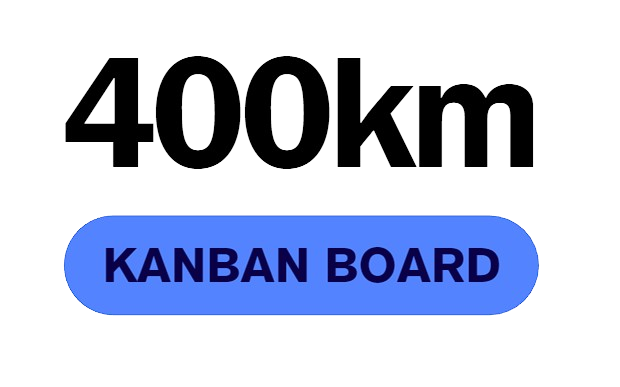

<p align="center">
  <a href="http://nestjs.com/" target="blank"></a>
</p>

[circleci-image]: https://img.shields.io/circleci/build/github/nestjs/nest/master?token=abc123def456
[circleci-url]: https://circleci.com/gh/nestjs/nest

  <p align="center">A progressive <a href="http://nodejs.org" target="_blank">Node.js</a> framework for building efficient and scalable server-side applications.</p>
    <p align="center">
<a href="https://www.npmjs.com/~nestjscore" target="_blank"></a>
<a href="https://www.npmjs.com/~nestjscore" target="_blank"></a>
<a href="https://www.npmjs.com/~nestjscore" target="_blank"></a>
<a href="https://circleci.com/gh/nestjs/nest" target="_blank"></a>
<a href="https://coveralls.io/github/nestjs/nest?branch=master" target="_blank"></a>
<a href="https://discord.gg/G7Qnnhy" target="_blank"></a>
<a href="https://opencollective.com/nest#backer" target="_blank"></a>
<a href="https://opencollective.com/nest#sponsor" target="_blank"></a>
  <a href="https://paypal.me/kamilmysliwiec" target="_blank"></a>
    <a href="https://opencollective.com/nest#sponsor"  target="_blank"></a>
  <a href="https://twitter.com/nestframework" target="_blank"></a>
</p>
  <!--[](https://opencollective.com/nest#backer)
  [](https://opencollective.com/nest#sponsor)-->

## Description



### 칸반 보드

- **팀이 업무와 각 팀원이 할 수 있는 작업량 간에 밸런스를 맞추는 도구**입니다
  - 칸반 보드는 프로젝트의 업무량과 워크플로우를 더 효과적으로 시각화해 프로젝트를 관리합니다.
  - 보드에서 업무는 열로 구성된 프로젝트 보드에 표시되며, 각 열은 업무 단계를 나타냅니다.

## Members

<table>
  <tbody>
    <tr>
      <td align="center"><a href="https://github.com/heyfuxkingcheez"><br /><sub><b> 팀장 : 정기욱 </b></sub></a><br /></td>
      <td align="center"><a href="https://github.com/asdfg20564"><br /><sub><b> 팀원 : 권유진 </b></sub></a><br /></td>
       <td align="center"><a href="https://github.com/PachyuChepe"><br /><sub><b> 팀원 : 배윤호 </b></sub></a><br /></td>
      <td align="center"><a href="https://github.com/Han9526"><br /><sub><b> 팀원 : 한승준 </b></sub></a><br /></td>
    </tr>
  </tbody>
</table>

## Skills

## Installation

```bash
$ npm install
```

## Running the app

```bash
# development
$ npm run start

# watch mode
$ npm run start:dev

# production mode
$ npm run start:prod
```

## Test

```bash
# unit tests
$ npm run test

# e2e tests
$ npm run test:e2e

# test coverage
$ npm run test:cov
```

## Support

Nest is an MIT-licensed open source project. It can grow thanks to the sponsors and support by the amazing backers. If you'd like to join them, please [read more here](https://docs.nestjs.com/support).

## Stay in touch

- Author - [Kamil Myśliwiec](https://kamilmysliwiec.com)
- Website - [https://nestjs.com](https://nestjs.com/)
- Twitter - [@nestframework](https://twitter.com/nestframework)

## License

Nest is [MIT licensed](LICENSE).
