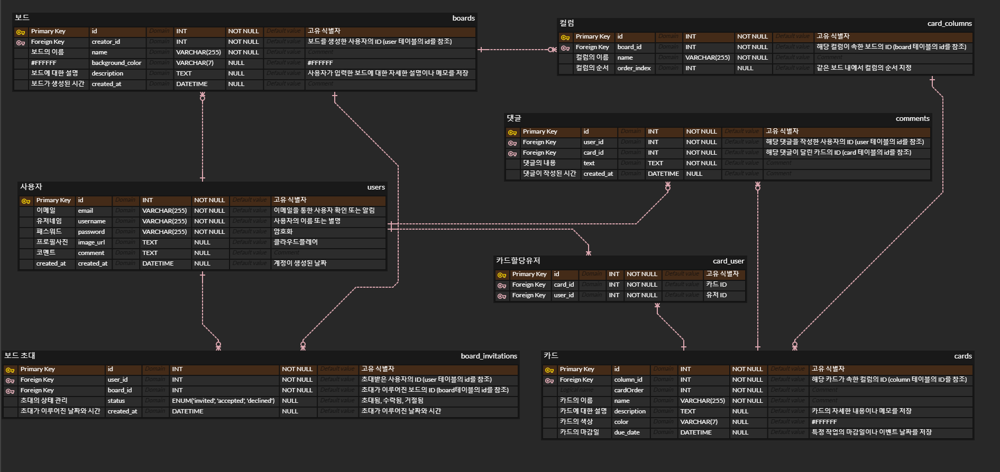

## ProJect


### 칸반 보드

- **팀이 업무와 각 팀원이 할 수 있는 작업량 간에 밸런스를 맞추는 도구**입니다
  - 칸반 보드는 프로젝트의 업무량과 워크플로우를 더 효과적으로 시각화해 프로젝트를 관리합니다.
  - 보드에서 업무는 열로 구성된 프로젝트 보드에 표시되며, 각 열은 업무 단계를 나타냅니다.

## Link

https://www.sisok400km.store/

## Members

<table>
  <tbody>
    <tr>
      <td align="center"><a href="https://github.com/heyfuxkingcheez"><br /><sub><b> 팀장 : 정기욱 </b></sub></a><br /></td>
      <td align="center"><a href="https://github.com/asdfg20564"><br /><sub><b> 팀원 : 권유진 </b></sub></a><br /></td>
       <td align="center"><a href="https://github.com/PachyuChepe"><br /><sub><b> 팀원 : 배윤호 </b></sub></a><br /></td>
      <td align="center"><a href="https://github.com/Han9526"><br /><sub><b> 팀원 : 한승준 </b></sub></a><br /></td>
    </tr>
  </tbody>
</table>

## Skills

- 
- 
- 

## env

- SERVER_PORT

- DB_HOST
- DB_PORT
- DB_USERNAME
- DB_PASSWORD
- DB_NAME
- DB_SYNC

- REDIS_HOST
- REDIS_PORT
- REDIS_USERNAME
- REDIS_PASSWORD

- JWT_SECRET_KEY

- ACCOUNT_ID
- API_TOKEN

- NODE_MAIL_ID
- NODE_MAIL_PW

## ERD



## API

https://www.notion.so/400km-f186b59576814aa6bcbe2aada3f904db?pvs=4

## file

```
📦trello_project
 ┣ 📂app-docs
 ┃ ┣ 📜.http
 ┃ ┣ 📜card.http
 ┃ ┣ 📜column.http
 ┃ ┣ 📜comment.http
 ┃ ┣ 📜image.png
 ┃ ┗ 📜user.http
 ┣ 📂public
 ┃ ┣ 📂css
 ┃ ┃ ┣ 📜body-background-image.css
 ┃ ┃ ┣ 📜header-footer.css
 ┃ ┃ ┣ 📜loading.css
 ┃ ┃ ┗ 📜reset.css
 ┃ ┣ 📂image
 ┃ ┃ ┣ 📜background-image.gif
 ┃ ┃ ┣ 📜background-image1.gif
 ┃ ┃ ┣ 📜background-image2.gif
 ┃ ┃ ┣ 📜background-image3.gif
 ┃ ┃ ┣ 📜logo.png
 ┃ ┃ ┣ 📜pngwing.com.png
 ┃ ┃ ┗ 📜Profil.png
 ┃ ┣ 📂script
 ┃ ┃ ┣ 📜board.js
 ┃ ┃ ┣ 📜header-footer.js
 ┃ ┃ ┣ 📜loading.js
 ┃ ┃ ┣ 📜user-info-edit.js
 ┃ ┃ ┣ 📜user-login.js
 ┃ ┃ ┣ 📜user-my-page.js
 ┃ ┃ ┗ 📜user-signup.js
 ┃ ┣ 📜board-main-page-prototype.html
 ┃ ┣ 📜board.html
 ┃ ┣ 📜footer.html
 ┃ ┣ 📜header.html
 ┃ ┣ 📜index.html
 ┃ ┣ 📜user-info-edit.html
 ┃ ┣ 📜user-login.html
 ┃ ┣ 📜user-my-page.html
 ┃ ┗ 📜user-signup.html
 ┣ 📂src
 ┃ ┣ 📂auth
 ┃ ┃ ┣ 📂dto
 ┃ ┃ ┃ ┣ 📜login-user.dto.ts
 ┃ ┃ ┃ ┣ 📜send-verification-code.dto.ts
 ┃ ┃ ┃ ┗ 📜verify-email.dto.ts
 ┃ ┃ ┣ 📂guard
 ┃ ┃ ┃ ┣ 📜board-invitation.guard.ts
 ┃ ┃ ┃ ┣ 📜jwt-auth.guard.ts
 ┃ ┃ ┃ ┗ 📜local-auth.guard.ts
 ┃ ┃ ┣ 📂strategy
 ┃ ┃ ┃ ┣ 📜jwt.strategy.ts
 ┃ ┃ ┃ ┗ 📜local.strategy.ts
 ┃ ┃ ┣ 📜auth.controller.ts
 ┃ ┃ ┣ 📜auth.module.ts
 ┃ ┃ ┗ 📜auth.service.ts
 ┃ ┣ 📂board-invitations
 ┃ ┃ ┣ 📂dto
 ┃ ┃ ┃ ┣ 📜invitation.dto.ts
 ┃ ┃ ┃ ┗ 📜update-invitation.dto.ts
 ┃ ┃ ┣ 📂entities
 ┃ ┃ ┃ ┗ 📜board-invitation.entity.ts
 ┃ ┃ ┣ 📜board-invitations.controller.spec.ts
 ┃ ┃ ┣ 📜board-invitations.controller.ts
 ┃ ┃ ┣ 📜board-invitations.module.ts
 ┃ ┃ ┣ 📜board-invitations.service.spec.ts
 ┃ ┃ ┗ 📜board-invitations.service.ts
 ┃ ┣ 📂boards
 ┃ ┃ ┣ 📂dto
 ┃ ┃ ┃ ┗ 📜board.dto.ts
 ┃ ┃ ┣ 📂entities
 ┃ ┃ ┃ ┗ 📜board.entity.ts
 ┃ ┃ ┣ 📜boards.controller.spec.ts
 ┃ ┃ ┣ 📜boards.controller.ts
 ┃ ┃ ┣ 📜boards.module.ts
 ┃ ┃ ┣ 📜boards.service.spec.ts
 ┃ ┃ ┗ 📜boards.service.ts
 ┃ ┣ 📂cards
 ┃ ┃ ┣ 📂dto
 ┃ ┃ ┃ ┗ 📜card.dto.ts
 ┃ ┃ ┣ 📂entities
 ┃ ┃ ┃ ┣ 📜card.entity.ts
 ┃ ┃ ┃ ┗ 📜card_user.entity.ts
 ┃ ┃ ┣ 📂types
 ┃ ┃ ┃ ┗ 📜status.type.ts
 ┃ ┃ ┣ 📜cards.controller.ts
 ┃ ┃ ┣ 📜cards.module.ts
 ┃ ┃ ┗ 📜cards.service.ts
 ┃ ┣ 📂columns
 ┃ ┃ ┣ 📂dto
 ┃ ┃ ┃ ┣ 📜column.dto.ts
 ┃ ┃ ┃ ┣ 📜column.movebtn.dto.ts
 ┃ ┃ ┃ ┗ 📜column.movedrag.dto.ts
 ┃ ┃ ┣ 📂entities
 ┃ ┃ ┃ ┗ 📜column.entity.ts
 ┃ ┃ ┣ 📜columns.controller.spec.ts
 ┃ ┃ ┣ 📜columns.controller.ts
 ┃ ┃ ┣ 📜columns.module.ts
 ┃ ┃ ┣ 📜columns.service.spec.ts
 ┃ ┃ ┗ 📜columns.service.ts
 ┃ ┣ 📂comments
 ┃ ┃ ┣ 📂dto
 ┃ ┃ ┃ ┗ 📜create-comment.dto.ts
 ┃ ┃ ┣ 📂entities
 ┃ ┃ ┃ ┗ 📜comment.entity.ts
 ┃ ┃ ┣ 📜comments.controller.ts
 ┃ ┃ ┣ 📜comments.module.ts
 ┃ ┃ ┗ 📜comments.service.ts
 ┃ ┣ 📂configs
 ┃ ┃ ┣ 📂cloudflare
 ┃ ┃ ┃ ┣ 📜cloudflare.module.ts
 ┃ ┃ ┃ ┗ 📜cloudflare.service.ts
 ┃ ┃ ┣ 📂nodemailer
 ┃ ┃ ┃ ┗ 📜email.service.ts
 ┃ ┃ ┣ 📂redis
 ┃ ┃ ┃ ┣ 📜redis.module.ts
 ┃ ┃ ┃ ┗ 📜redis.service.ts
 ┃ ┃ ┣ 📜database-config.ts
 ┃ ┃ ┗ 📜env-valid.ts
 ┃ ┣ 📂users
 ┃ ┃ ┣ 📂dto
 ┃ ┃ ┃ ┣ 📜create-user.dto.ts
 ┃ ┃ ┃ ┗ 📜update-user.dto.ts
 ┃ ┃ ┣ 📂entities
 ┃ ┃ ┃ ┗ 📜user.entity.ts
 ┃ ┃ ┣ 📜users.controller.ts
 ┃ ┃ ┣ 📜users.module.ts
 ┃ ┃ ┗ 📜users.service.ts
 ┃ ┣ 📜app.controller.ts
 ┃ ┣ 📜app.module.ts
 ┃ ┣ 📜app.service.ts
 ┃ ┗ 📜main.ts
 ┣ 📜.env
 ┣ 📜.eslintrc.js
 ┣ 📜.gitignore
 ┣ 📜.prettierrc
 ┣ 📜nest-cli.json
 ┣ 📜nodemon.json
 ┣ 📜package-lock.json
 ┣ 📜package.json
 ┣ 📜README.md
 ┣ 📜tsconfig.build.json
 ┣ 📜tsconfig.json
 ┗ 📜디비세팅.png
```

## Installation

```
npm install
```

## Running the app

```

npm run start


npm run start:dev

```
